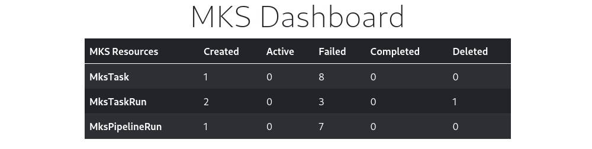

```bash
    ███╗   ███╗██╗  ██╗███████╗    ██╗   ██╗██╗
    ████╗ ████║██║ ██╔╝██╔════╝    ██║   ██║██║
    ██╔████╔██║█████╔╝ ███████╗    ██║   ██║██║
    ██║╚██╔╝██║██╔═██╗ ╚════██║    ██║   ██║██║
    ██║ ╚═╝ ██║██║  ██╗███████║    ╚██████╔╝██║
    ╚═╝     ╚═╝╚═╝  ╚═╝╚══════╝     ╚═════╝ ╚═╝
```

---

## mks-ui

Minimal Tekton Server Dashboard is a simple web page to show the statistics for
the [mks-server](https://github.com/MiniTeks/mks-server) from the database.

## Build mks-ui from source

### Prerequisites

This application needs a `go 1.17 compiler` to build and a kubernetes cluster to run.
You can also use `minikube` or `kind` to run on your local machine. Please install
in advance.

### Steps to build

- Clone the repository using:

```bash
    git clone https://github.com/MiniTeks/mks-ui.git
```

- Make sure you have all the go dependencies

```bash
    go mod tidy

    go mod vendor
```

- Build the project using:

```bash
    go build ./cmd/web
```

- Run mks-server before launching the dashboard

```bash
    ./web
```

- Open [localhost:6000](localhost:6000) in your browser

### Screenshot



### License

Licensed under the Apache License, Version 2.0 (the "License"); you may not use this file except in compliance with the License.
